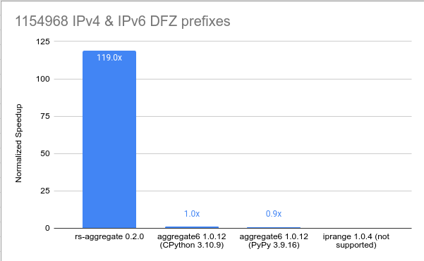
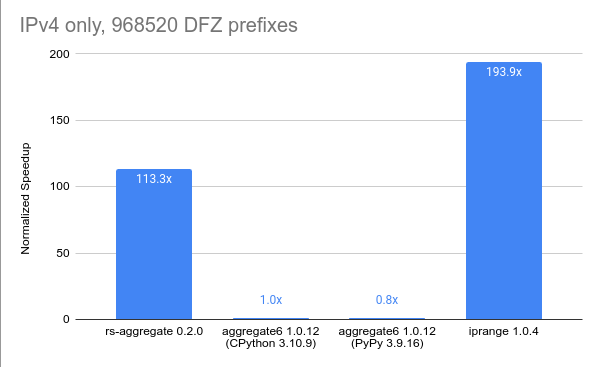

# rs-aggregate
rs-aggregate will aggregate an unsorted list of IP prefixes

Intended to be a drop-in replacement for [aggregate6](https://github.com/job/aggregate6) with better performance.

Takes a list of whitespace-separated IPs or IP networks and aggregates them to their minimal representation.

## Known discrepancies with `aggregate6`

* `rs-aggregate` accepts subnet and wilcard mask formats in addition to CIDR, ie all these are valid and equivalent:
  * `1.1.1.0/255.255.255.0`
  * `1.1.1.0/0.0.0.255`
  * `1.1.1.0/24`
* `-m/--max-prefixlen` supports different maximums for each address family as ipv4,ipv6 format

## Performance

Performance comparison of `rs-aggregate` vs `aggregate6`. A speedup of >100x is achieved on DFZ data.

Full DFZ (1154968 total, 202729 aggregates):

IPv4 DFZ (968520 total, 154061 aggregates):
